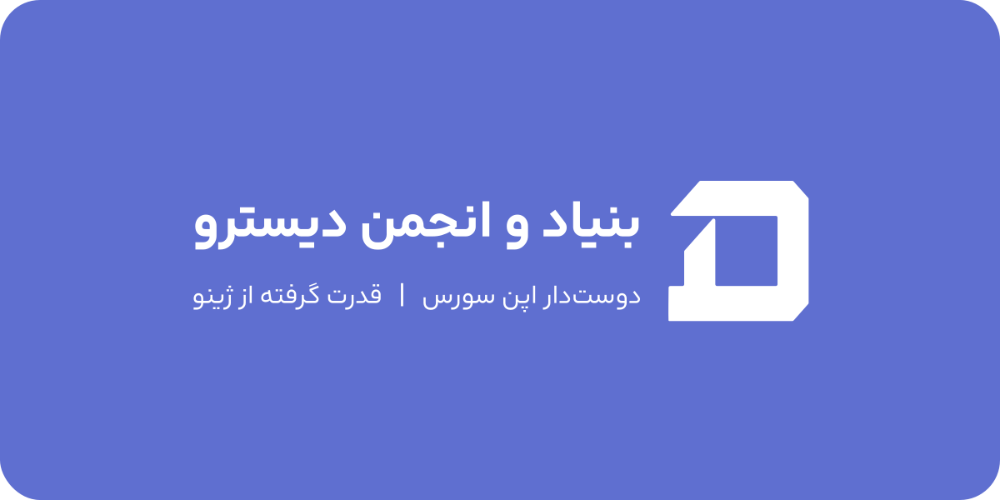

<h2>بنیاد دیسترو</h2>
<h4>قدرت گرفته از ژینو</h4>

<a href="https://github.com/distrofdn">English</a> | <a href="https://github.com/DistroFdn/DistroFdn/blob/main/README.FA.md">Farsi</a>

## مطالب
- [🚀 درباره دیسترو](#overview)
- [📝 اساسنامه](#charter)
- [💡 پروژه ها](#projects)
- [☎️ ارتباط با ما](#contact)
- [🤝 حمایت](#donate)

## درباره دیسترو

Distro (بنیاد Distro) یک بنیاد برای حمایت از دنیای متن‌باز است که به تولید و نظارت بر پروژه‌های مفید برای جوامع توسعه‌دهنده در سراسر جهان می‌پردازد. با ایجاد ایده‌های جدید، پیاده‌سازی ایده‌های مختلف، و انتشار رایگان آن‌ها در جهان، Distro گامی در جهت توسعه جوامع متن‌باز ایران برداشته است.

## اساسنامه

### ماده ۱ - نام و مشخصات بنیاد

- نام بنیاد: بنیاد Distro / دیسترو ( از این به بعد اساس‌نامه این بنیاد از اسم Distro برای اشاره به خود استفاده می‌کند )
- نوع فعالیت: متن‌باز (Open Source)  
- زیرمجموعه: استارتاپ ژینو  
- محل فعالیت: بنیاد Distro تحت قوانین جمهوری اسلامی ایران فعالیت می‌کند و تمامی فعالیت‌ها و تصمیم‌گیری‌های آن با رعایت قوانین داخلی کشور تنظیم می‌شود.  
- وبسایت رسمی: [https://Distro.Zhino.Dev](https://Distro.Zhino.Dev)

**بند ۱:** این بنیاد با هدف ایجاد یک جامعه ایرانی برای تولید و به اشتراک‌گذاری ابزارها و کتابخانه‌های متن‌باز، تحت مجوزهای شناخته شده بین‌المللی، فعالیت می‌کند. با محوریت بومی‌سازی ابزارهای توسعه نرم‌افزاری، این بنیاد به دنبال فراهم آوردن بستری راحت و قابل دسترس برای توسعه‌دهندگان ایرانی است.  
**بند ۲:** به عنوان زیرمجموعه‌ای از استارتاپ ژینو، بنیاد Distro از حمایت‌های فنی و مالی این استارتاپ برخوردار است. همکاری با ژینو موجب تسهیل در اجرای اهداف پروژه و رشد جامعه متن‌باز ایران خواهد شد.

### ماده ۲ - اهداف و مأموریت
- هدف بنیاد تولید ابزارها، کتابخانه‌ها و پروژه‌های متن‌باز جهت فراهم‌آوردن محیطی راحت و بومی برای توسعه‌دهندگان ایرانی است.
- بنیاد با گردهم‌آوردن توسعه‌دهندگان و برنامه‌نویسان ایرانی، تلاش می‌کند سطح فعالیت‌های ایران را در جامعه جهانی متن‌باز افزایش دهد و در این راستا، محیطی خلاق و پویا را برای به اشتراک‌گذاری ایده‌ها و پروژه‌های متن‌باز فراهم کند.

**بند ۱:** یکی از اهداف کلیدی بنیاد، افزایش مشارکت ایرانیان در جامعه حرفه‌ای متن‌باز جهانی است. این بنیاد تلاش می‌کند با تولید ابزارهای بومی و همکاری میان توسعه‌دهندگان ایرانی، نیازهای خاص برنامه‌نویسان و توسعه‌دهندگان در داخل ایران را به شکلی خلاقانه و کارآمد پاسخ دهد.  
**بند ۲:** بنیاد همچنین به دنبال ایجاد منابع آموزشی و مستندات لازم برای کاربران و توسعه‌دهندگان است تا بتوانند به راحتی از ابزارها و کتابخانه‌های توسعه یافته استفاده کنند و در پیشرفت آن‌ها سهیم باشند.

### ماده ۳ - مسئولیت‌ها و تعهدات اعضا
1. **اعضای توسعه‌دهنده**:
    - توسعه ابزارها، کتابخانه‌ها و ایده‌های جدید متن‌باز با هدف ارتقای سطح فناوری در ایران.
    - مشارکت فعال در پروژه‌های بنیاد و همکاری با سایر اعضا برای رفع مشکلات و توسعه قابلیت‌های جدید.
2. **اعضای جامعه**:
    - تست ابزارها و کتابخانه‌های توسعه‌یافته و ارائه بازخوردهای فنی و تجربی.
    - گزارش باگ‌ها و مسائل نرم‌افزاری و پیشنهاد راه‌حل‌های بهبود.
3. **مدیران بنیاد**:
    - هماهنگی و مدیریت فعالیت‌های بنیاد، تعیین راهبردها و اهداف کلان و ارائه گزارش‌های عملکرد به استارتاپ ژینو.
    - برگزاری جلسات منظم برای بررسی روند پیشرفت پروژه‌ها و ایجاد استراتژی‌های جدید.

**بند ۱:** اعضای توسعه‌دهنده موظف هستند که بر اساس اصول کدنویسی استاندارد و اخلاق حرفه‌ای در توسعه ابزارها و پروژه‌های متن‌باز عمل کنند. هرگونه توسعه نرم‌افزاری باید با در نظر گرفتن نیازهای جامعه برنامه‌نویسان ایران و هم‌راستا با اهداف بنیاد انجام شود.  
**بند ۲:** جامعه کاربران و توسعه‌دهندگان نیز با تست و ارائه بازخورد، نقش مهمی در بهبود و ارتقای کیفیت ابزارها و کتابخانه‌های بنیاد ایفا می‌کنند. این بازخوردها به مدیران بنیاد در تصمیم‌گیری‌های فنی کمک می‌کند.

### ماده ۴ - ساختار سازمانی
- **هسته اصلی بنیاد**: متشکل از اعضای کلیدی که مسئولیت تصمیم‌گیری‌های استراتژیک و فنی بنیاد را بر عهده دارند. این اعضا با همکاری مستقیم استارتاپ ژینو، برای تعیین اهداف کلان بنیاد و برنامه‌های اجرایی تلاش می‌کنند.
- **توسعه‌دهندگان جامعه**: شامل تمامی برنامه‌نویسان و توسعه‌دهندگانی است که از طریق پلتفرم GitHub یا دیگر بسترهای همکاری در پروژه‌های بنیاد مشارکت دارند.
- **کاربران و حامیان**: افراد و سازمان‌هایی که از ابزارها و منابع توسعه‌یافته توسط بنیاد استفاده می‌کنند یا به صورت مالی و معنوی از فعالیت‌های بنیاد حمایت می‌کنند.

**بند ۱:** هسته اصلی بنیاد شامل تیم مدیریت و گروهی از توسعه‌دهندگان باتجربه است که برای تحقق اهداف استراتژیک پروژه و تضمین کیفیت محصولات و خدمات بنیاد فعالیت می‌کنند. این تیم با هماهنگی استارتاپ ژینو در پیشبرد اهداف مشترک، تصمیمات کلیدی را اتخاذ می‌کند.  
**بند ۲:** توسعه‌دهندگان جامعه، به عنوان بخشی از اکوسیستم متن‌باز، وظیفه دارند تا با مشارکت فعال و ارائه کدهای بهینه، در رشد و توسعه پروژه‌های بنیاد نقش‌آفرینی کنند.

### ماده ۵ - روش مشارکت
1. هر کسی می‌تواند از طریق GitHub و دیگر بسترهای مشارکت، به عنوان توسعه‌دهنده یا تست‌کننده در پروژه‌های بنیاد مشارکت کند.
2. درخواست‌های کش (Pull Requests) توسط هسته اصلی بنیاد بررسی و در صورت تأیید وارد پروژه می‌شوند.
3. مشارکت‌کنندگان باید به قوانین و اصول کدنویسی استاندارد و اصول اخلاقی بنیاد پایبند باشند.

**بند ۱:** تمامی مشارکت‌کنندگان می‌توانند به صورت داوطلبانه و با ارائه پیشنهادات یا تغییرات در پروژه‌های مختلف مشارکت کنند. این فرایند از طریق سیستم‌های مدیریت پروژه‌های متن‌باز مانند GitHub مدیریت می‌شود.  
**بند ۲:** اعضا باید به اصول احترام متقابل و اخلاق حرفه‌ای در محیط همکاری پایبند باشند تا محیطی سالم و خلاق برای تمامی توسعه‌دهندگان و کاربران ایجاد شود.

### ماده ۶ - حق مالکیت و مجوزها
- تمامی کدها و منابع تولید شده در بنیاد تحت مجوزهای متن‌باز بین‌المللی مانند **GPL** یا **MIT** قرار می‌گیرند.
- مالکیت تمامی مشارکت‌ها در بنیاد به عنوان بخشی از یک تلاش جمعی در نظر گرفته می‌شود و مالکیت انفرادی بر روی کدها و ابزارهای توسعه‌یافته وجود ندارد.

**بند ۱:** تمام مشارکت‌کنندگان با ارائه کدها و پیشنهادات خود در بنیاد، موافقت می‌کنند که این مشارکت‌ها تحت مجوزهای متن‌باز به اشتراک گذاشته شوند و در دسترس عموم قرار گیرند. این موضوع باعث تضمین تداوم و دسترسی آزاد به پروژه‌ها حتی در صورت تغییرات مدیریتی می‌شود.  
**بند ۲:** بنیاد متعهد است که تمامی کدهای توسعه‌یافته را به شکلی شفاف و عمومی منتشر کند تا هر فرد یا سازمانی بتواند از آن‌ها استفاده کرده یا آن‌ها را گسترش دهد.

### ماده ۷ - قوانین حاکم بر بنیاد
- بنیاد Distro تحت قوانین جمهوری اسلامی ایران فعالیت می‌کند و به رعایت اصول و مقررات داخلی کشور و همچنین اصول اخلاقی حاکم بر جوامع متن‌باز جهانی متعهد است.
- رفتارهای غیرحرفه‌ای، تبعیض‌آمیز یا تخلف از قوانین موجب تعلیق یا حذف دسترسی افراد به پروژه خواهد شد.

**بند ۱:** تمامی اعضا و مشارکت‌کنندگان موظف به رعایت قوانین داخلی کشور و پایبندی به اخلاق حرفه‌ای و اصول رفتار مناسب در جامعه متن‌باز هستند. تخلفات ممکن است با اخطار یا مسدود شدن دسترسی همراه باشد.  
**بند ۲:** اصول حاکم بر بنیاد باید به گونه‌ای باشد که هر شخصی بدون تبعیض بتواند در فعالیت‌ها مشارکت داشته و از امکانات موجود استفاده کند.

### ماده ۸ - تأمین منابع مالی
- بنیاد از طریق حمایت‌های مالی استارتاپ ژینو، کمک‌های داوطلبانه افراد و همچنین حمایت‌های مالی از طرف سازمان‌های مختلف تأمین مالی می‌شود.
- هرگونه کمک مالی به صورت شفاف و عمومی گزارش می‌شود و منابع مالی بنیاد تحت نظارت هسته اصلی و ژینو مدیریت می‌شود.

**بند ۱:** بنیاد به منظور ادامه فعالیت‌ها و توسعه پروژه‌ها به حمایت‌های مالی نیاز دارد. این حمایت‌ها می‌تواند از طریق کمک‌های داوطلبانه افراد یا سازمان‌ها تأمین شود. بنیاد متعهد است که تمامی منابع مالی را به شکل شفاف مدیریت کرده و در مورد استفاده از آن‌ها گزارش دهد.  
**بند ۲:** استارتاپ ژینو به عنوان پشتیبان مالی بنیاد نقش مهمی در تأمین منابع مالی ایفا می‌کند. ژینو همچنین با ارائه مشاوره‌های فنی و راهبردی به رشد بنیاد کمک می‌کند.

### ماده ۹ - تصمیم‌گیری‌ها
- تمامی تصمیمات کلان و اساسی در مورد بنیاد توسط هسته اصلی اتخاذ می‌شود و تصمیمات باید به تأیید اکثریت اعضا برسد.
-

تصمیم‌گیری‌های فنی و اجرایی نیز باید بر اساس نظرات جمعی و در هماهنگی با استارتاپ ژینو صورت گیرد.

**بند ۱:** هسته اصلی بنیاد مسئولیت دارد که با مشورت سایر اعضا و استارتاپ ژینو، تصمیمات کلیدی در مورد راهبردها و اهداف بنیاد را اتخاذ کند. این تصمیمات شامل تغییرات فنی، گسترش پروژه‌ها، و تنظیم سیاست‌های جدید است.  
**بند ۲:** تمامی مشارکت‌کنندگان می‌توانند نظرات و پیشنهادات خود را برای بهبود پروژه‌ها مطرح کنند و تصمیم‌گیری‌های کلان باید با توجه به این نظرات جمعی صورت گیرد.

### ماده ۱۰ - انحلال بنیاد
- در صورت انحلال بنیاد، تمامی کدها و منابع توسعه یافته به صورت متن‌باز و عمومی در دسترس باقی خواهند ماند.
- تصمیم به انحلال بنیاد باید با توافق اکثریت اعضای هسته اصلی و تأیید استارتاپ ژینو اتخاذ شود.

**بند ۱:** انحلال بنیاد تنها در صورت توافق اعضای کلیدی و پس از بررسی‌های دقیق ممکن است. در صورت انحلال، تمامی ابزارها و کتابخانه‌های تولید شده تحت مجوزهای متن‌باز باقی خواهند ماند و دسترسی عمومی به آن‌ها همچنان تضمین خواهد شد.  
**بند ۲:** بنیاد موظف است پیش از هرگونه تصمیم‌گیری در مورد انحلال، با اعضای جامعه و حامیان مالی خود مشورت کند و توضیحات لازم را ارائه دهد.

## پروژه ها 

Lime (بزودی)

## تماس با ما

جهت ارتباط و ارسال انتقادات یا پیشنهادات خود با ایمیل زیر در ارتباط باشید.

<distro@zhino.dev>

نظر شما به بهبودی و ارتقا سطح کیفیت کار ما یاری خواهد نمود.

