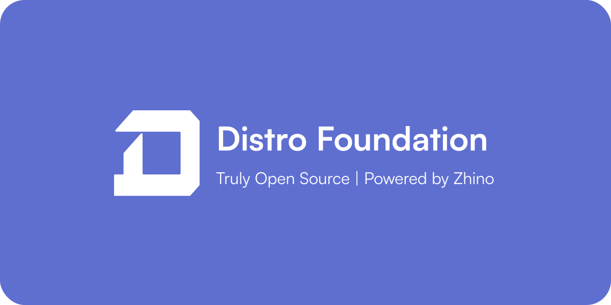

<h2>Distro Foundation</h2>
<h4>Truly Open Source | Powered by Zhino</h4>

<a href="https://github.com/distrofdn">English</a> | <a href="https://github.com/distrofdn/README.FA.md">Farsi</a>

## Content
- [🚀 Overview](#overview)
- [📝 Charter](#charter)
- [💡 Projects](#projects)
- [☎️ Contact Us](#contact)
- [🤝 Donation](#donate)

## Overview

Distro (Distro Foundation) is a foundation for supporting the Open Source world, producing and monitoring projects beneficial to the development communities of the world. By creating new ideas and implementing different ideas and releasing them for free in the world, the Distro has taken a step in the development of Iran's Open Source communities.

## Charter

#### Art. 1 - Denomination and Specification of the Foundation

- **Distro Foundation** / Distro, hereby referred to as **Distro** for the remaining portion of this charter.  
- Type of Activity: **Open Source**  
- Subsidiary: **Zhino Startup**  
- Place of Operation: **Distro Foundation** operates its activities under the Islamic Republic of Iran, and all its activities and decisions are aligned with the country's domestic regulations.  
- Official Website: [https://Distro.Zhino.Dev](https://Distro.Zhino.Dev)

#### Clause 1:
It is a foundation that aims at building an Iranian community for the development and sharing of open-source tools and libraries licensed under internationally recognized licenses. With a focus on software localization development tools, the foundation intends to provide an easily accessible platform for Iranians.

##### Clause 2:
As the subsidiary of **Zhino Startup**, Distro Foundation benefits from technical and financial support given by Zhino, a help which is greatly contributive toward achieving the project goals and development of the open-source community in Iran.

### Article 2 - Objectives and Mission
This foundation is working on developing open-source tools, libraries, and projects in order to make working with Iranian developers comfortable and native.
Through the gathering of Iranian developers and programmers, it strives to raise Iran's status among the open-source global community by fostering a creative space filled with sharing open-source ideas and projects.

##### Clause 1:
One of the crucial goals of the foundation is to increase Iranian involvement in the global open-source community. To the extent possible, and based on the particular Iranian developers' needs, the foundation has tried serving them by producing localized tools and facilitating collaboration among Iranian developers in a creative and effective way.

##### Clause 2:
Another goal of the foundation is to provide educational resources and documentation to both users and developers for easy usage of tools and libraries developed, thus making contributions towards advancing those tools and libraries.

### Article 3: Responsibilities and Obligations of Members
**Developer Members:**

- Writing open-source tools, libraries, and any innovative ideas to develop technology in Iran.
- Be an active contributor to Foundation Projects, in concert with other members, working out solutions and writing features.

**Community Members:**

- Test developed tools and libraries, provide technical and experiential feedback.
- Report bugs and issues in software and provide recommendations for improvement.

**Foundation Managers:**

- Coordinate and manage the activities of the foundation, define the strategic goals, and present performance reports to Zhino Startup.
- Hold regular meetings to review project progress and establish new strategies.

##### Clause 1:
Software development should be done with regard to Iranian developers' needs but also in accordance with the objectives set out by the foundation. The Foundation requires that developers adhere to the principles of standard coding practices and professional ethics in developing open-source tools and projects.

##### Clause 2:
This large user and developer community creates an additional value in continuous testing and feedback to further fine-tune the quality of the foundation's tools, on which the managers base their decisions regarding technical matters.

### Article 4 - Organizational Structure
**Core Foundation Team:**  
Comprises members responsible for strategic and technical decision-making for the foundation. Members shall collaborate directly with Zhino Startup in setting the major goals of the foundation and in carrying out its programs.

**Community Developers:**  
Must include all programmers and developers contributing to the foundation's projects through GitHub or other collaborative platforms.

**Users and Advocates:**  
Individuals and organizations that apply the tools and resources developed by the foundation, or provide financial and moral support for its activities.

##### Clause 1:
This core team is the management team and a group of professional developers who dedicate effort and time to attaining strategic objectives of the foundation towards the realization of quality products and services. This body cooperates with Zhino Startup to make major decisions towards this objective.

##### Clause 2:
In the open-source community, community developers should commit themselves to the active participation and optimization of code contributions towards the growth and development of the foundation's projects.

### Article 5 - Forms of Participation
The foundation's projects are open to anyone on GitHub or other collaboration platforms as a developer or tester.  
Pull Requests are reviewed by the core foundation team and, if approved, are merged into the project.  
Participants should code according to the foundation's standardized coding principles and behavioral guidelines.

##### Clause 1:
Any contributor may voluntarily contribute by suggesting or making changes in any project. This is managed through free project management systems using GitHub.

##### Clause 2:
Members should respect mutual consideration and professionalism in the collaborative environment so that a healthy and creative space could be created for all developers and users.

### Article 6 - Ownership and Licensing
All the code and materials produced by the Foundation are licensed through international free software licenses, such as GPL or MIT. Individual ownership of contributions developed and written to the foundation is considered contribution to a collective work; no contributor has individual ownership of developed code or tools.

##### Clause 1:
What contributors agree to is that all their contributions are shared in open-source licenses and are publicly available to everyone. This guarantees that the projects will be continuously accessible, openly shared, even when there's a change in the management.

##### Clause 2:
The foundation is committed to releasing all code developed under its auspices freely and publicly, to allow any individual or organization to use or develop it further.

### Article 7 - Laws that Govern the Foundation
The Distro Foundation is under the Islamic Republic of Iran's laws, and it shall try its best to respect the domestic regulations of this country and the ethical principles of the global open-source community.

Unprofessional behavior, discriminatory action, or violation of the rules may be cause for suspension or revocation of access to the project.

##### Clause 1:
Members and participants must also respect all domestic laws of the country and shall keep professional ethics and proper behavior in the open-source community. Failure to do so may result in warnings or blockage of access.

##### Clause 2:
The basic operational regulations should allow the participation of all, whether in activities or service utilization, on an equal basis without discrimination.

### Article 8 - Financial Resources
These were facilitated by financial support provided by Zhino Startup, popular voluntary contributions, and financial backing by organizations.  
All donations are transparently reported, while the financial assets of the Foundation are managed by the supervision of the core team and Zhino.

##### Clause 1:
Financial support is needed by the Foundation, in the form of voluntary contributions from individuals or organizations, to continue its activities and start projects. The Foundation shall handle all financial resources with full transparency and account for their use.

##### Clause 2:
His importance involves him in the vital grant that keeps the foundation running. Besides this, he assists the foundation in technical and strategic advisory roles.

### Article 9 - Decision-Making
The decisions, which are core and major, are about the foundation, and this has to be supported by a majority vote. The technical and operational decisions are also to be made by joint participation and in cooperation with Zhino Startup.

##### Clause 1:
Core members are expected to consult with the members and Zhino Startup in reaching major decisions about the strategies and objectives of the Foundation. These matters will include decisions on technical changes, expanding the project, or constituting new policies.

##### Clause 2:
All participants can give their views and opinions on the development of specific projects. Major decisions must be made by taking into consideration all these ideas.

### Article 10 - Dissolution of the Foundation
Upon dissolution, all code and resources developed under the foundation will remain open source and freely available to the public.  
The decision for dissolution of the foundation shall be taken by the majority of the core team members and confirmed by Zhino Startup.

##### Clause 1:
The dissolution of the Foundation shall be done with due deliberation and by consent from core members only. Upon dissolution, all developed tools and libraries will remain under open-source licenses to ensure ongoing access by the general public.

##### Clause 2:
The foundation shall consult the community members and financial supporters of every explanation before taking any decision concerning dissolution.

## Projects

Lime (Soon)

## Contact Us

You can reach out to us with your feedback and suggestions at this email address. 

Our email address: distro@zhino.dev

Your input is valuable in enhancing our work.